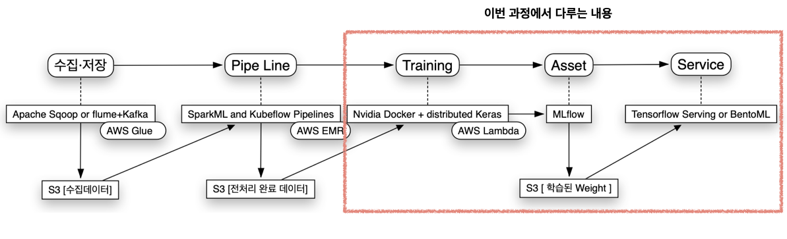

# DeepLearningServing
딥러닝 시스템을 구축하기 위한 데이터 수집/저장·빅데이터가공·멀티서버 트레이닝·Asset관리·서비스 제공에 대한 예제 모음

* [1.DeepLearningServingSystem](1.DeepLearningServingSystem/) : 딥러닝 서빙 시스템
* [2.AITensorflowTraining](2.AITensorflowTraining/) : AI Tensorflow Training
* [3.AIAssetManagement](3.AIAssetManagement/) : AI Asset Management
* [4.AIService](4.AIService/) : AI Service
